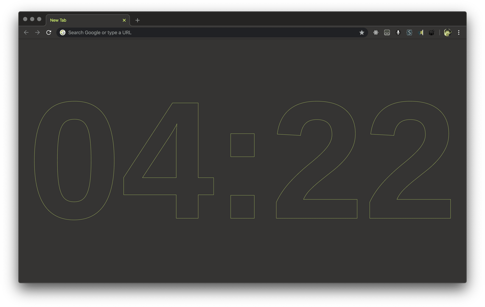
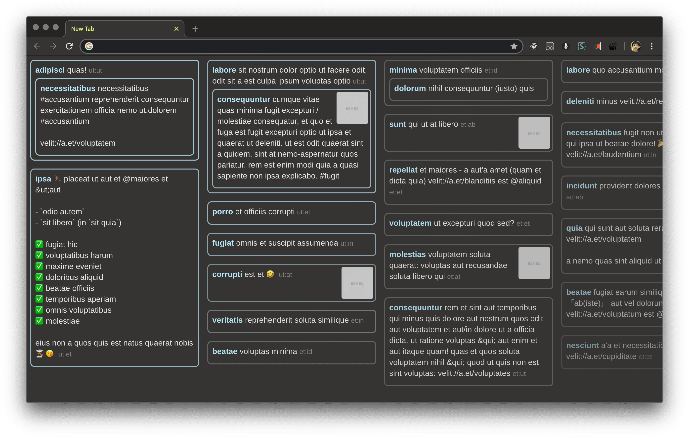

# dtinth’s Chrome new tab page

## Features

When opening a new tab, I see a clock.



Scrolling down, I see the most recent tweets from a subset of my Twitter friends.
Since some friends tweet a lot while others occasionally, I made it so that it displays at most 1 latest tweet per person, so tweets by friends who don’t tweet a lot don’t get drowned.



## Setting up

> **Note:** The set up you see here is very convoluted and user-unfriendly. Since I made this for my own use, I use multiple 3rd party services (some of which no longer allows new sign ups) to help me build this quickly with the least amount of custom code or maintenance required. It assumes you know how to use Firebase and webtask (no longer accepting sign-ups).

The constraints are:

- I don't want to manage any server. I prefer using PaaS like Firebase.
- I don't want to run any extra process on my machine. So no server running on `localhost`.

Also:

- In the future, this new tab page might not only contain data from Twitter.
  I might make it fetch content from RSS feed, etc.
  I should be able to accomplish this by just deploying new code and not have to edit existing parts.

So I model this project into multiple subcomponents.
We have a central data store for our **cards**.
Each card is one item that is displayed in the new tab page.
Here is the dependency graph:

```
                                                                    +----------------+
                                                                    | Cloud cron job | (webtask)
                                                                    +----------------+
                                                                          |  invokes
                                                                          v  periodically
   +--------------+   fetch cards    +------------+    sends cards   +-------------+
   | New tab page | ---------------> | Data store | <--------------- | Fetch tasks | (webtask)
   +--------------+                  +------------+                  +-------------+
  (Chrome extension)                 (On Firebase)                        |  fetches
                                                                          v  data
                                                                     +-------------+
                                                                     | Twitter API |
                                                                     +-------------+
```

1. The **Chrome extension** that replaces the new tab page. It does not talk to any third-party APIs (like Twitter API), but reads data through the database hosted on Firebase Firestore. It contains:

   - The background script that synchronizes the data between the browser and Firebase.
     This is so that the latest information is displayed right away and so that we don't have to download new data every time we open a new tab.
   - The new tab page which requests the data from the background script and displays it.

2. A **Firebase project** that stores the data.

   - Firebase Cloud Firestore is used to store the data and provide synchronization mechanism to the Chrome extension.

     Cards are stored as documents in a collection **`cards`**. Each document contains these fields:

     - `title` The title of the card. For Twitter this is the username of the author.
     - `description` The text to display. For Twitter this is the tweet text.
     - `url` URL to go when clicking on this card.
     - `time` Date.prototype.toJSON-formatted date string.
     - `tweet` Twitter only. The JSON-encoded representation of the original tweet object.

     Security rules only allow user with uid `root` to access.

   - Firebase Cloud Function exposes a data ingestion API.

     It exposes an endpoint **`POST /writeCards`**.
     The data should be sent in this format:
     
     ```json
     {
       "cards": [
         {
           "id": "twitter:dtinth",
           "data": {
             "title": "dtinth",
             "description": "I made it...",
             "url": "https://twitter.com/dtinth",
             "time": "2019-12-21T17:00:00.000Z"
           }
         }
       ]
     }
     ```

     The request needs the `Authorization` header of `Bearer <api.key>`, where the API key is set via `firebase functions:config:set`.
     It will put the cards into Firestore if the card is newer.

3. A **webtask** that periodically fetches data from Twitter (and other sources) and sends it to the ingestion API.

### Chrome extension setup

1. Go to `chrome://extensions` enable developer mode

2. Click “Load unpacked” and select the `extension` directory

### Firebase project setup

1. Deploy Firestore rules.

   ```
   yarn firebase deploy --only firestore
   ```

2. Generate a random API key (e.g. 48ffd19d786214277747c8ceeab26756ddcf7af0) and set it up for the ingestion API.

   ```
   yarn firebase functions:config:set api.key=48ffd19d786214277747c8ceeab26756ddcf7af0
   ```

3. Deploy Firebase functions.

   ```
   yarn firebase deploy --only functions
   ```

### Authentication setup

This is a single-user setup.
Firestore rules is set to only allow user with id `root` to access the data.
So we need to be able to generate a user with that uid, and also login as that user.
I use [firebase-root](https://github.com/dtinth/firebase-root) to generate it.

```sh
# In `firebase-root` project
export GOOGLE_APPLICATION_CREDENTIALS=/path/to/service-account.json
node cli token
```

Then go to the new tab page, open Chrome DevTools, and run:

```js
firebase.auth().signInWithCustomToken(prompt())
```

and paste in the generated token.

### webtask setup

1. Go to https://webtask.io/make

2. Set up a webtask with this code:

   ```js
   /**
   * @param context {WebtaskContext}
   */
   var Twitter = require('twitter')
   var axios = require('axios')

   module.exports = async function (context, cb) {
     try {
       var client = new Twitter({
         consumer_key: context.secrets.TWITTER_CK,
         consumer_secret: context.secrets.TWITTER_CS,
         access_token_key: context.secrets.TWITTER_ATK,
         access_token_secret: context.secrets.TWITTER_ATS
       });
       const [me, slug] = context.secrets.TWITTER_LIST.split('/')
       const response = await client.get('lists/statuses', {
         slug: slug,
         owner_screen_name: me,
         count: 100,
         include_rts: false,
         include_entities: true,
         tweet_mode: 'extended'
       });

       const cards = []
       const seen = new Set()
       for (const item of response) {
         const id = `twitter:${item.user.screen_name}`
         if (seen.has(id)) continue
         seen.add(id)
         const text = item.extended_tweet && item.extended_tweet.full_text || item.full_text || item.text
         const url = `https://twitter.com/${item.user.screen_name}` // /status/${item.id_str}`
         cards.push({
           id,
           data: {
             title: item.user.screen_name,
             description: text,
             time: new Date(item.created_at).toJSON(),
             url,
             tweet: JSON.stringify(item),
           }
         })
       }
       const writeResponse = await axios.post(context.secrets.LATEST_CARDS_ENDPOINT, { cards }, {
         headers: {
           Authorization: `Bearer ${context.secrets.LATEST_CARDS_BEARER_TOKEN}`
         }
       })
       cb(null, writeResponse.data + ', cards=' + cards.length)
     } catch (e) {
       cb(e)
     }
   };
   ```

3. Set up secrets:
   
   - `TWITTER_CK` Consumer key
   - `TWITTER_CS` Consumer secret
   - `TWITTER_ATK` Access token key
   - `TWITTER_ATS` Access token secret
   - `TWITTER_LIST` A Twitter list to use as source (such as `dtinth/subset`)
   - `LATEST_CARDS_ENDPOINT` Endpoint to cloud function: `https://___.cloudfunctions.net/writeCards`
   - `LATEST_CARDS_BEARER_TOKEN` The token set in Firebase project.

4. Set up npm modules:

   - `twitter@1.7.1`
   - `axios@0.19.0`

5. Set up scheduling — set it to run every 5 mins.
